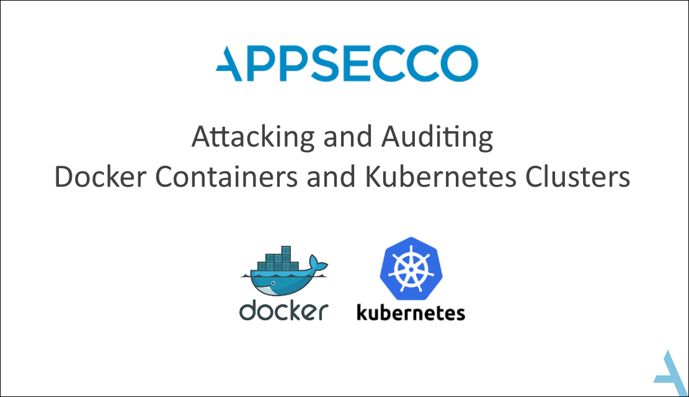

# Attacking and Auditing Docker Containers and Kubernetes Clusters



## Introduction

The world is changing right in front of our eyes. The way we have been learning is going to be radically transformed by the time we all have eradicated the COVID19 from our lives.

While we figure out what is the best way to transfer our knowledge to you, we realise that by the time world is out of the lockdown, a docker and kubernetes focussed pentesting training is likely going to be obsolete in parts.

So as a contribution towards the greater security community, we decided to open source the complete training.

Hope you enjoy this release and come back to us with questions, comments, feedback, new ideas or anything else that you want to let us know! Looking forward to hacking with all of you!

## Description

An organisation using microservices or any other distributed architecture rely heavily on containers and container orchestration engines like Kubernetes and as such its infrastructure security is paramount to its business operations.

This course will set the base for security testers and DevOps teams to test for common security vulnerabilities and configuration weaknesses across containerised environments and distributed systems. It also helps to understand approach and process to audit the Kubernetes environment for security posture.

The courseware is meant to introduce participants to container and cluster management with Kubernetes.

* The focus is on the security aspects of application and the container infrastructure
* The participants will learn the common tools and techniques that are used to attack applications running in containerized environments
* The participants will be introduced to Kubernetes and learn to assess the attack surfaces applicable for a given application on the cluster
* The participants will learn how to audit for security based on best practices using tools and custom scripts

## About this Repo

This repo contains all the material from our 3 day hands on training that we have delivered at security conferences and to our numerous clients.

The training requires following components

1. Lab manual (Documentation)
2. Docker Lab virtual machines
3. Intentionally vulnerable Kubernetes cluster (Google Cloud)

| Content       | Description                                                                 |
| ------------- | --------------------------------------------------------------------------- |
| `gitbook`     | Complete documentation for training                                         |
| `infra-setup` | Scripts for setting up vulnerable Kubernetes infrastructure in Google Cloud |

## Getting Started

1. Clone this repo
2. Start the Gitbook server
3. Follow the gitbook

### Starting Gitbook Server

Install `gitbook-cli`

```
npm install -g gitbook-cli
```

Start Gitbook to serve locally

```
cd gitbook && gitbook serve
```

Navigate to `http://localhost:4000`

## License

* Documentation and Gitbook are released under [Creative Commons Attribution Share Alike 4.0 International](CC-BY-SA-LICENSE.txt)
* Lab material including any code, script are release under [MIT License](MIT-LICENSE.txt)
