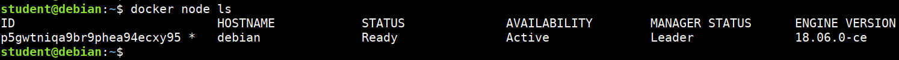
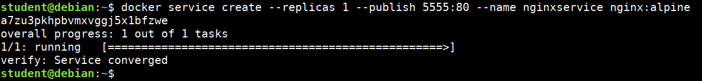
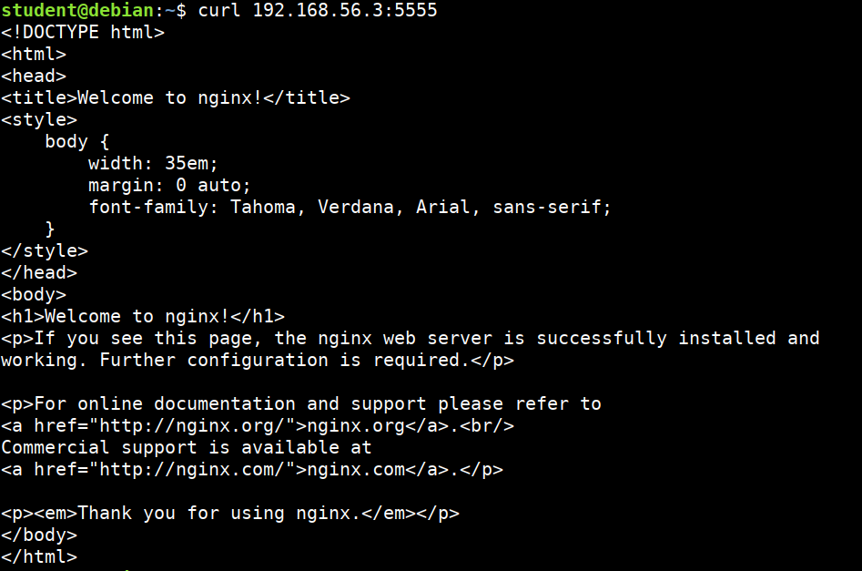

# Docker Swarm

A swarm is a group of machines that are running Docker and joined into a cluster. After that has happened, you continue to run the Docker commands you're used to, but now they are executed on a cluster by a swarm manager. The machines in a swarm can be physical or virtual.


* Let's setup docker swarm cluster

```bash
docker swarm init
```

* Check the list of nodes

```bash
docker node ls
```



* Starting new service in docker swarm cluster

```bash
docker service create --replicas 1 --publish 5555:80 --name nginxservice nginx:alpine
```



* Look at the running services

```bash
docker service ls
```

* Inspecting the service

```bash
docker service inspect --pretty nginxservice
```

* Accessing the service

```bash
curl STUDENTIP:5555
```



* Removing the service

```bash
docker service rm nginxservice
```

* Leaving the swarm cluster

```bash
docker swarm leave

# If only one node in the cluster
docker swarm leave --force
```

## References

* [Getting started with swarm](https://docs.docker.com/engine/swarm/swarm-tutorial/)