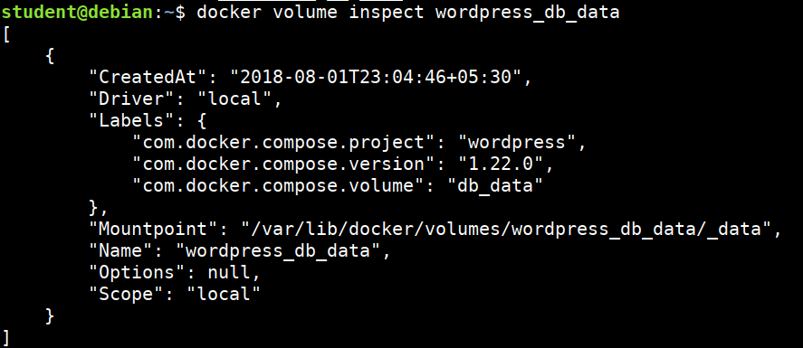

# Auditing Docker Volumes and Networks

## Listing and inspecting the docker volumes

* Listing docker volumes

```bash
docker volume ls
```


* Inspecting docker volumes

```bash
docker volume inspect wordpress_db_data
```



* Volumes can be used with Ready-Only, Read-Write modes


## Listing and inspecting the docker networks

* Docker by default creates it's own networking namespace when we use Docker Swarm or Docker Compose

* By default bridge, host, null networking options are available

* Listing the docker networks

```bash
docker network ls
```


* Inspecting the docker network

```bash
docker inspect wordpress_default
```


> We can use our traditional toolset like `nmap` (or) `nc` for performing scans and information gathering