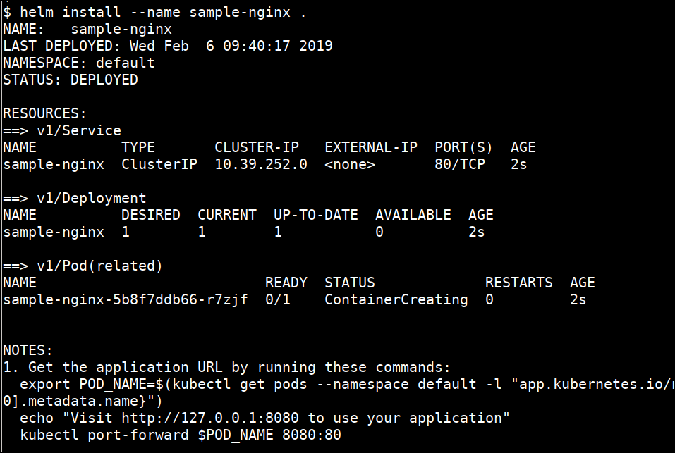
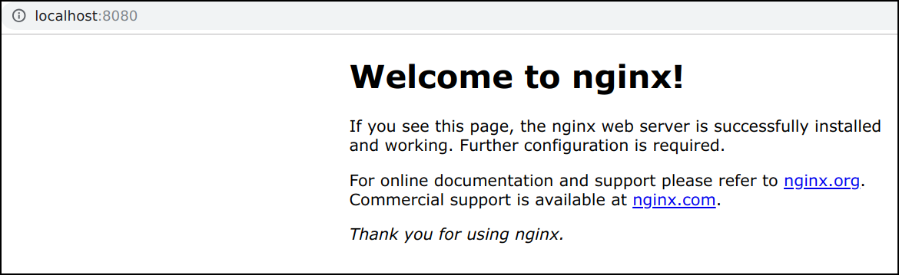
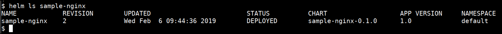

# Deploying simple application in Kubernetes Cluster using Helm Chart

* Deploying an app using basic helm chart, navigate to `sample-nginx` helm chart folder

```bash
cd /data/sample-nginx
```

* Deploy the helm chart by running the following command

```bash
helm install --name sample-nginx .
```



* Access the app using output template

```bash
export POD_NAME=$(kubectl get pods --namespace default -l "app.kubernetes.io/name=sample-nginx,app.kubernetes.io/instance=sample-nginx" -o jsonpath="{.items[0].metadata.name}")
kubectl port-forward $POD_NAME 8080:80
```

* Visit http://127.0.0.1:8080 to use your application



* Change the `values.yaml` in the sample-nginx helm chart. Replace `tag: alpine` with `tag: latest`

```bash
...
tag: alpine
...

to

...
tag: latest
...
```

* Upgrade the helm chart with new release

```bash
helm upgrade sample-nginx .
```

* Check the helm chart details and revisions

```bash
helm ls sample-nginx
```


* Deleting the helm chart

```bash
helm delete --purge sample-nginx
```

### References

* [https://docs.helm.sh/](https://docs.helm.sh/)