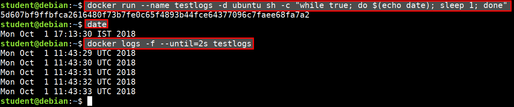

# Docker Logging

The `docker logs` command shows information logged by a running container. The `docker service logs` command shows information logged by all containers participating in a service. The information that is logged and the format of the log depends almost entirely on the container's endpoint command.

## Examples

* Fetch the logs of a container

```bash
docker logs containername

# follow the stream
docker logs -f containername
```

* Retrieve logs until a specific point in time

```bash
docker run --name testlogs -d ubuntu sh -c "while true; do $(echo date); sleep 1; done"

date
Mon Oct  1 17:12:27 IST 2018

docker logs -f --until=2s testlogs
Mon Oct  1 11:41:36 UTC 2018
Mon Oct  1 11:41:37 UTC 2018
Mon Oct  1 11:41:38 UTC 2018
```



### Reference

* [docker logs](https://docs.docker.com/v17.12/engine/reference/commandline/logs/)
* [Logging with Docker](https://medium.com/@yoanis_gil/logging-with-docker-part-1-b23ef1443aac)