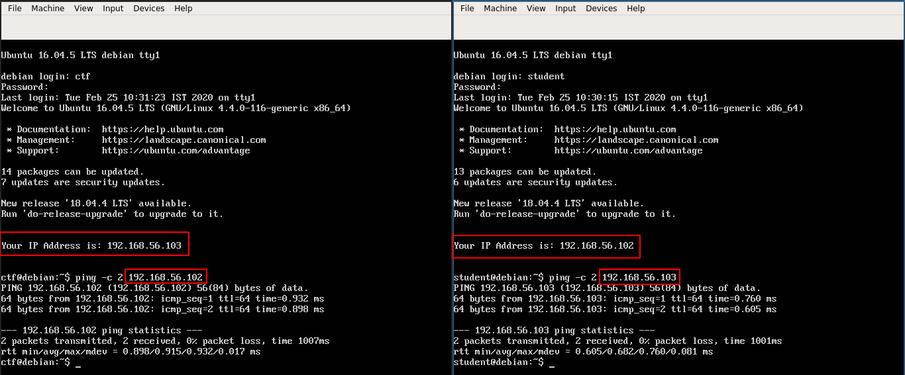
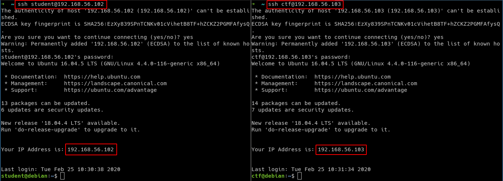

# Importing virtual machines

The students need to import two virtual machines for docker labs

1. `docker-student.ova`
2. `docker-ctf.ova`


## Download VM

| VM Name | Source URL |
|---------|------------|
| docker-student.ova | http://www.mediafire.com/file/72xe4d4vv10fgxz/docker-student.ova/file |
| docker-ctf.ova | http://www.mediafire.com/file/39e1w5wt7tmxr43/docker-ctf.ova/file |

The `checksums` are available at `http://www.mediafire.com/file/6xp3c7voy60zn1e/checksum.txt/file`

## Student Machine (docker-student.ova)

* Open VirtualBox, and select `File` -> `Import Appliance` from the top menu


* Select `docker-student.ova` file from the `workshop-content` folder


* Check the "Reintialize the MAC address of all network cards" checkbox, and click on Next to import the ova file


* Now we can see that ova file is importing


* Use following credentials for `student` VM login

```bash
username: student
password: Docker@321
```


* Your IP address may differ from what is visible in the screenshot. Please note down this IP address for later use

## CTF Machine (docker-ctf.ova)


* Open VirtualBox, and select `File` -> `Import Appliance` from the top menu


* Select `docker-ctf.ova` file from the `workshop-content` folder


* Check the "Reintialize the MAC address of all network cards" checkbox, and click on Next to import the ova file


* Use following credentials for `ctf` VM login

```bash
username: ctf
password: Dockerctf@321
```


* Your IP address may differ from what is visible in the screenshot. Please note down this IP address for later use

## Test Setup

### Ensure Networking within VM

> Ensure you are able to `ping` one VM from the other.



### Ensure SSH Access from Host

> Ensure you are able to SSH into both `Student` and `CTF` VM from your host using an SSH client.

