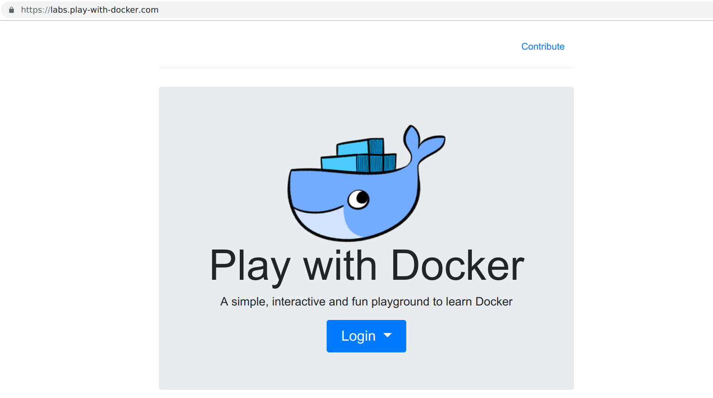

# Play with Docker

The Play with Docker classroom brings you labs and tutorials that help you get hands-on experience using Docker. In this classroom you will find a mix of labs and tutorials that will help Docker users, including SysAdmins, IT Pros, and Developers. There is a mix of hands-on tutorials right in the browser, instructions on setting up and using Docker in your own environment, and resources about best practices for developing and deploying your own applications.

### References

* [https://training.play-with-docker.com](https://training.play-with-docker.com/)