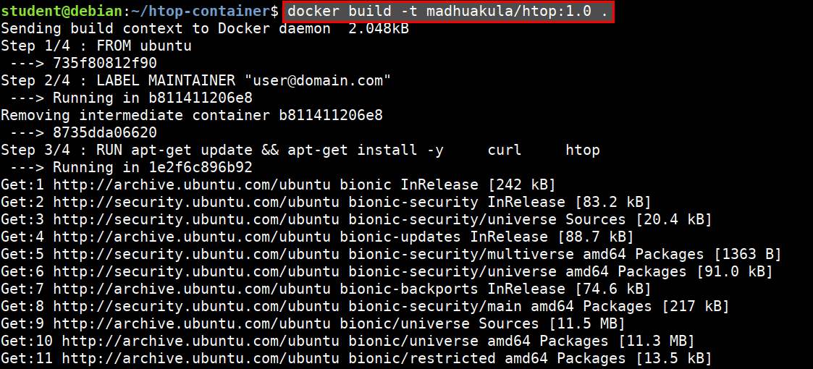

# Dockerfile

A `Dockerfile` is a configuration file that contains instructions for building a Docker image

* Provides a more effective way to build images compared to using docker commit
* Easily fits into your continuous integration and deployment process


## Example Dockerfile

* `FROM` instruction specifies what the base image should be
* `RUN` instruction specifies a command to execute
* `CMD` is to provide defaults for an executing container

```Dockerfile
# Example of a comment
FROM ubuntu

RUN apt-get update
RUN apt-get install curl -y
RUN apt-get install htop -y

CMD ["htop"]
```

## Create a simple htop container

* Create new directory and change to the directory

```bash
mkdir htop-container
cd htop-container
```

* Create below file using `vi Dockerfile`

```Dockerfile
FROM ubuntu
LABEL MAINTAINER "user@domain.com"

RUN apt-get update && apt-get install -y \
    curl \
    htop

CMD ["htop"]
```

* Build the docker container

```bash
docker build -t abh1sek/htop:1.0 .
```



* Running the `htop` container

```bash
docker run --rm -it abh1sek/htop:1.0
```

## References

* [Dockerfile reference](https://docs.docker.com/engine/reference/builder)
* [Best practices for writing Dockerfiles](https://docs.docker.com/develop/develop-images/dockerfile_best-practices/)