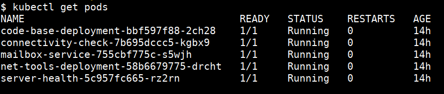

# Configure the `kubectl`

* Start Kubernetes student VM
* Copy your configuration file `k8s-training-kubeconfig` to `/home/student/.kube/config`
  * The file `k8s-training-kubeconfig` is generated by `setup.sh` script as part of cluster creation
* Run the below command to confirm that everything works fine

```bash
kubectl get pods
```


