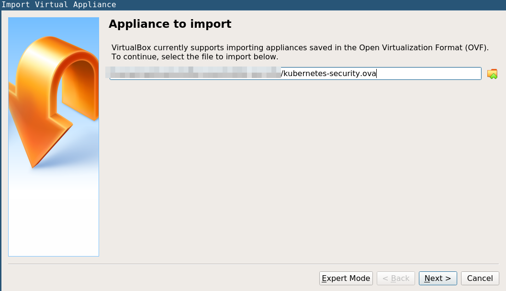
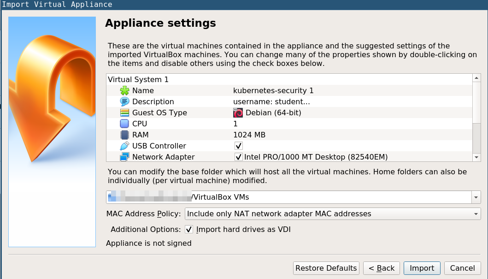
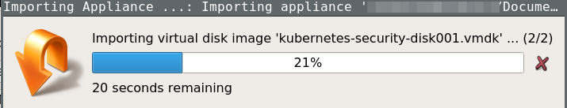

# Download Kubernetes Student VM

* http://www.mediafire.com/file/b739545szyrc6i5/kubernetes-security.ova/file
* http://www.mediafire.com/file/asz5xukxg1lhs3r/kubernetes-security.ova.checksum/file

# Import VM

* Click on Virtual Box `File` -> `Import`

* Browse to the ova of k8s-security and import the file


* Click on Import





* Login to the vm using below credentials

```bash
username: student
password: hackk8s
```