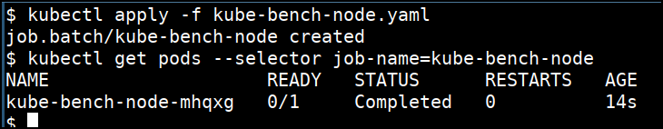
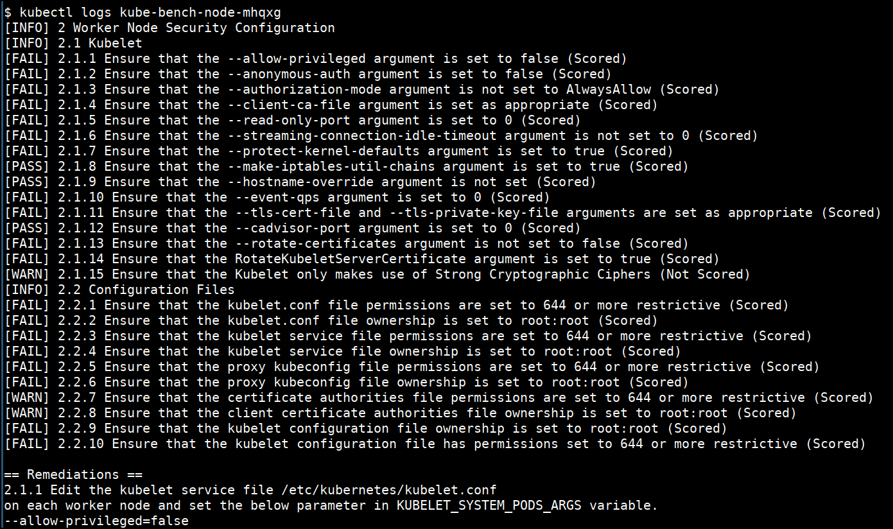

# Running kube-bench

kube-bench is a Go application that checks whether Kubernetes is deployed securely by running the checks documented in the [CIS Kubernetes Benchmark](https://www.cisecurity.org/benchmark/kubernetes/).

1. Master Node Security Configuration
    * API Server
    * Scheduler
    * Controller Manager
    * Configuration Files
    * etcd
    * General Security Primitives
    * PodSecurityPolicices
2. Workere Node Security Configuration
    * Kubelet
    * Configuration Files
    
## How to run kube-bench

* We can run kube-bench by navigating to the `cd /data/kube-bench`

```bash
kubectl apply -f kube-bench-node.yaml
```

* Check the job status and get the pod name

```bash
kubectl get pods --selector job-name=kube-bench-node
```



* See the kube-bench node scan results by checking the stdout logs

```bash
kubectl logs <PODNAME>
```




> Note: Here we are running only for the Kubernetes nodes as this cluster is managed by GCP. We can also run master checks by referring to https://github.com/aquasecurity/kube-bench