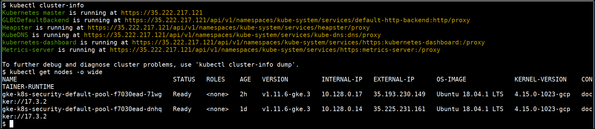
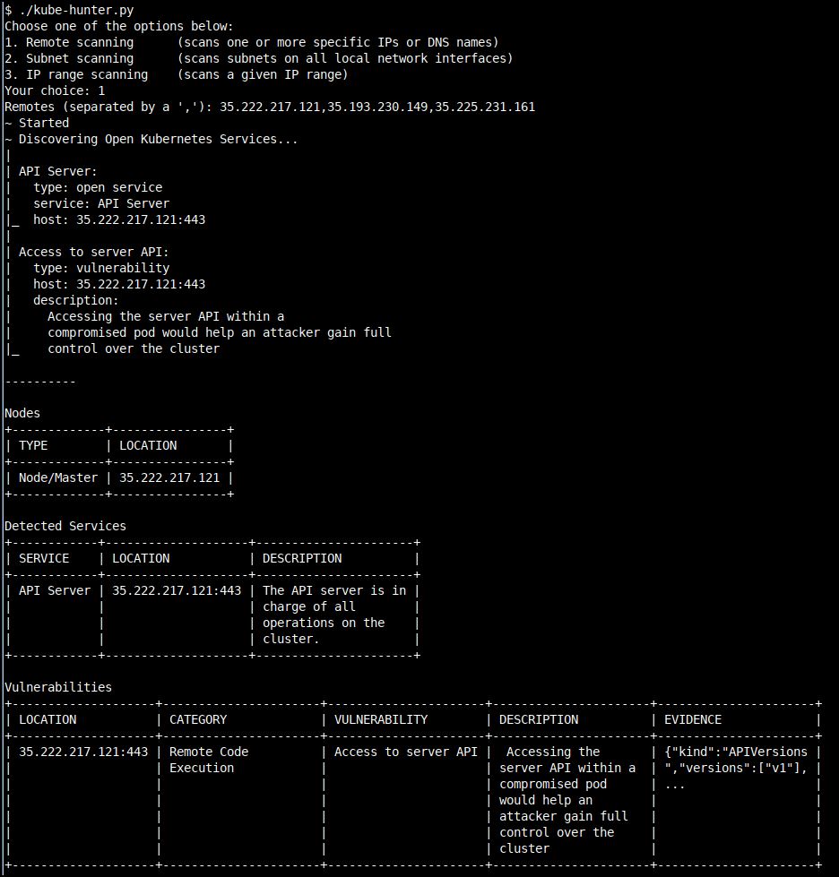
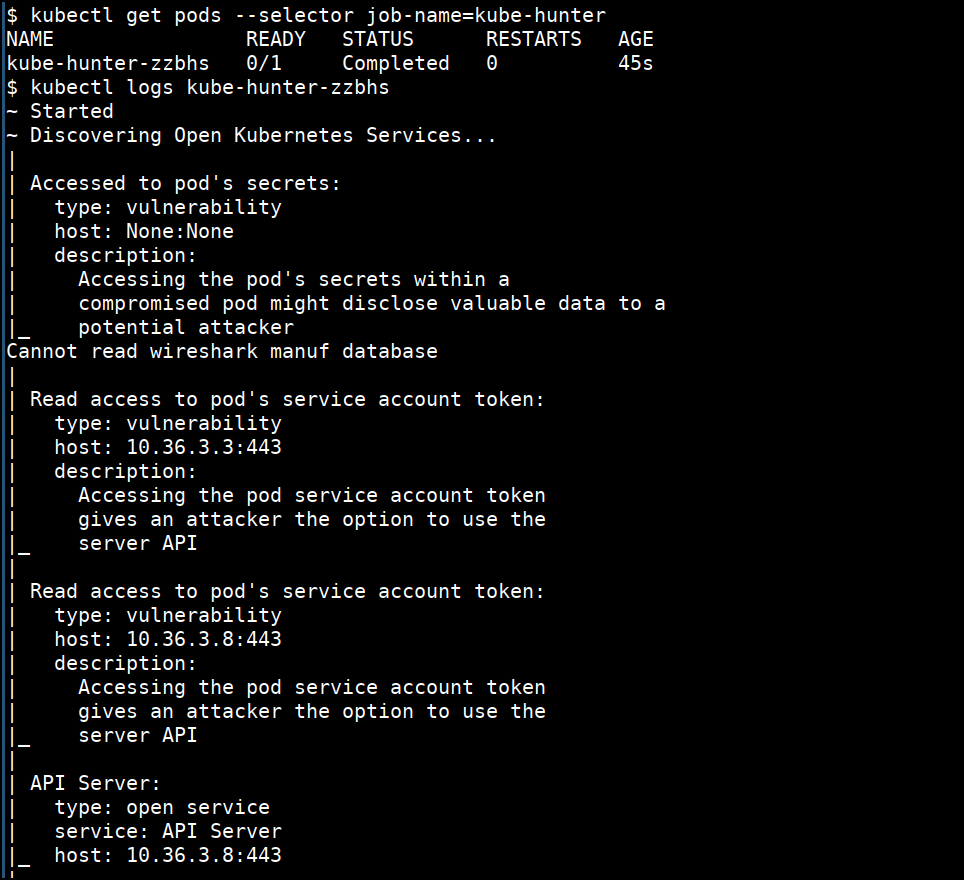

# Running kube-hunter

Kube-hunter hunts for security weaknesses in Kubernetes clusters. The tool was developed to increase awareness and visibility for security issues in Kubernetes environments. **You should NOT run kube-hunter on a Kubernetes cluster you don't own!**

## How to run kube-hunter

* IP addresses can be obtained by running the following command

```bash
kubectl cluster-info
kubectl get nodes -o wide
```




* Let's run kube-hunter from outside the cluster as a black box. Select the option `1` to perform "Remote Scanning".

```bash
cd /data/kube-hunter
./kube-hunter.py
```



* We can also run the kube-hunter as a active scan within the cluster as well

```bash
cd /data/kube-hunter
kubectl apply -f job.yaml
```

* Get the results by looking at stdout logs of the pod

```bash
kubectl get pods --selector job-name=kube-hunter
kubectl logs <PODNAME>
```




### References

* [https://github.com/aquasecurity/kube-hunter](https://github.com/aquasecurity/kube-hunter)