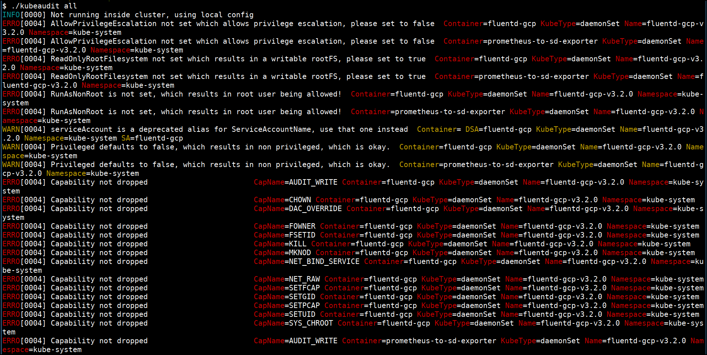

# Running kubeaudit

kubeaudit is a command line tool to audit Kubernetes clusters for various different security concerns:
* run the container as a non-root user
* use a read only root filesystem
* drop scary capabilities
* don't add new ones
* don't run privileged
* etc.

## How to run kubeaudit

* Running the `kubeaudit` with all checks

```bash
cd /data/kubeaudit
./kubeaudit all
```




> We can also use `kubeaudit` to fix vulnerabilities in a live cluster `*Not recommended for production`

### References

* [https://github.com/Shopify/kubeaudit](https://github.com/Shopify/kubeaudit)