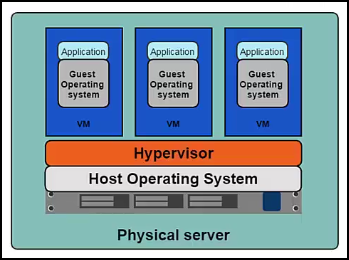
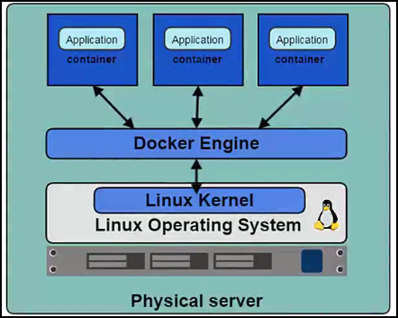

# Introduction to Kubernetes

## Why Containers

The Old Way to deploy applications was to install the applications on a host using the operating system package manager. This had the disadvantage of entangling the applications' executables, configuration, libraries and lifecycles with each other and with the host OS. One could build immutable virtual machines(VM) in order to achieve predictable rollouts and rollbacks, but VMs are heavyweight and non-portable.

The New Way is to deploy containers based on operating system level virtualization rather than hardware virtualization. These containers are isolated from each other and from the host

- they have their own filesystem
- they can't see each others processes
- their computational resource usage can be bounded

They are easier to build than VMs, and because they are decoupled from the underlying infrastructure and from the host filesystem, they are portable across public IAAS clouds and OS distributions.

## Why Kubernetes

A lot of developers have moved or are moving from a traditional world to a container based ecosystem. This allows developers to package their application code, dependencies and required libraries in a simple container and use it anywhere wherever there is a container runtime available.

> An example of a container runtime is Docker

At a minimum, Kubernetes can schedule and run application containers on clusters of physical or virtual machines. However, Kubernetes also allows developers to ‘cut the cord’ to physical and virtual machines, moving from a host-centric infrastructure to a container-centric infrastructure.

This approach provides the full advantages and benefits inherent to containers. Kubernetes provides the infrastructure to build a truly container centric development environment. This is the primary reason developers love it.

## What is Kubernetes

With Kubernetes, you are able to quickly and efficiently respond to customer demand

- Deploy your applications quickly and predictably
- Scale your applications on the fly
- Roll out new features seamlessly
- Limit hardware usage to required resources only
- Our goal is to foster an ecosystem of components and tools that relieve the burden of running applications in public and private clouds

> According to Brian Grant [Kubernetes is an open-source platform designed to automate deploying, scaling, and operating application containers](http://www.slideshare.net/BrianGrant11/wso2con-us-2015-kubernetes-a-platform-for-automating-deployment-scaling-and-operations).

Kubernetes is

- **Portable**: public, private, hybrid, multi-cloud
- **Extensible**: modular, pluggable, hookable, composable
- **Self-healing**: auto-placement, auto-restart, auto-replication, auto-scaling

> Google started the Kubernetes project in 2014. Kubernetes builds upon a [decade and a half of experience that Google has with running production workloads at scale](https://research.google.com/pubs/pub43438.html), combined with best-of-breed ideas and practices from the community.

### Additional references for further reading

- [https://aucouranton.com/2014/06/13/linux-containers-parallels-lxc-openvz-docker-and-more/](https://aucouranton.com/2014/06/13/linux-containers-parallels-lxc-openvz-docker-and-more/)
- [https://kubernetes.io/docs/concepts/overview/what-is-kubernetes/](https://kubernetes.io/docs/concepts/overview/what-is-kubernetes/)
