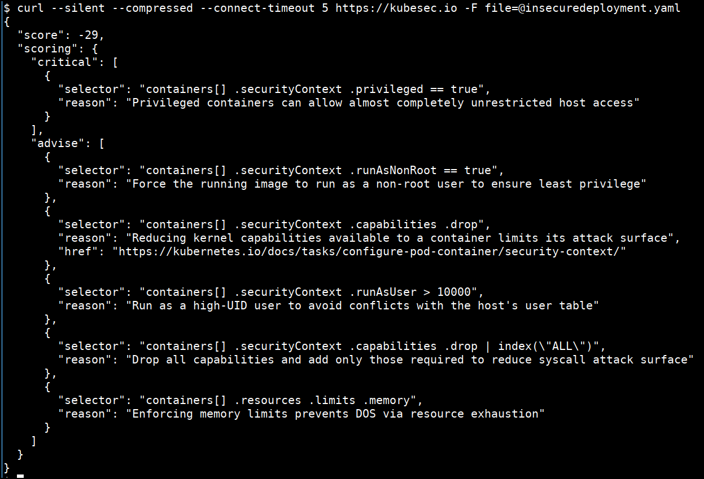
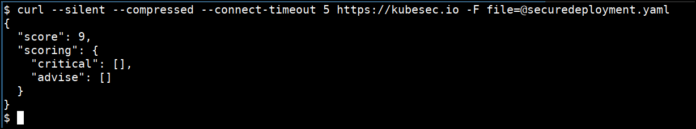

# Running kubesec.io

Kubesec quantifies risk for Kubernetes resources by validating the configuration files and manifest files used for Kubernetes deployments and operations.

## How to run kubesec

* Replace the `${FILE}` with the filename which you want to perform the scan

```bash
cd /data/kubesec
curl --silent --compressed --connect-timeout 5 https://kubesec.io -F file=@"${FILE}"
```

* Run for the `insecuredeployment.yaml`

```yaml
apiVersion: v1
kind: Pod
metadata:
  name: kubesec-demo
spec:
  containers:
  - name: kubesec-demo
    image: gcr.io/google-samples/node-hello:1.0
    securityContext:
      privileged: true
      readOnlyRootFilesystem: true
```

```bash
curl --silent --compressed --connect-timeout 5 https://kubesec.io -F file=@"insecuredeployment.yaml"
```




* Run for the `securedeployment.yaml`

```yaml
apiVersion: v1
kind: Pod
metadata:
  name: kubesec-demo
spec:
  containers:
  - name: kubesec-demo
    image: gcr.io/google-samples/node-hello:1.0
    securityContext:
      runAsNonRoot: true
      capabilities: 
        drop: ["ALL"]
        add: ["NET_ADMIN", "SYS_TIME"]
      readOnlyRootFilesystem: true
      runAsUser: 100000
    resources:
      requsts:
        cpu: 20m
        memory: 30Mi
      limits:
        cpu: 10m
        memory: 20Mi
```

```bash
curl --silent --compressed --connect-timeout 5 https://kubesec.io -F file=@"securedeployment.yaml"
```



### References
* [https://kubesec.io](https://kubesec.io/)
* [https://xsses.rocks/kubernetes-systems-hacked-to-mine-xmr](https://xsses.rocks/kubernetes-systems-hacked-to-mine-xmr/)