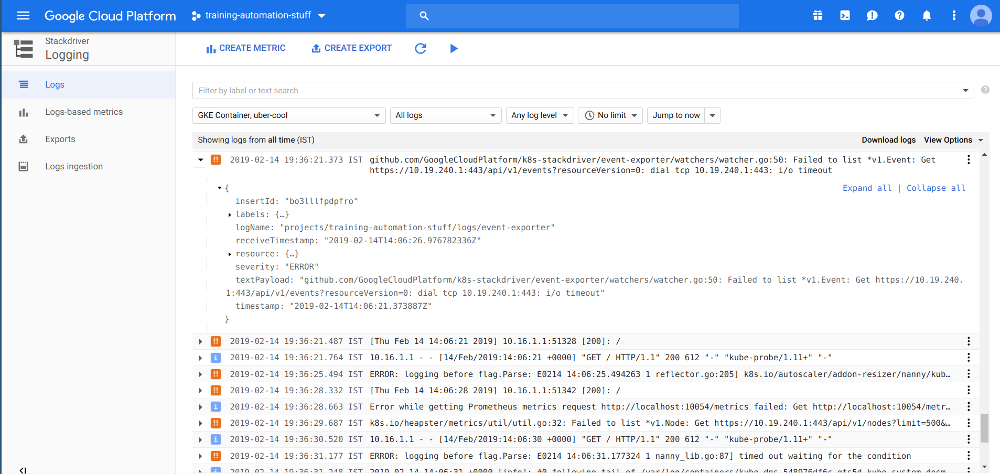

# Logging and Monitoring for Kubernetes

We can get more detailed information about kubernetes and it's resources using built-in commands

* Looking for more information about pods

```bash
kubectl describe pod <PODNAME>
```

* Looking for logs of pods

```bash
kubectl logs -f <PODNAME>
```

* Looking complete information about cluster (to debug and diagnose cluster problems)

```bash
kubectl cluster-info dump
```

* Stack driver logging

