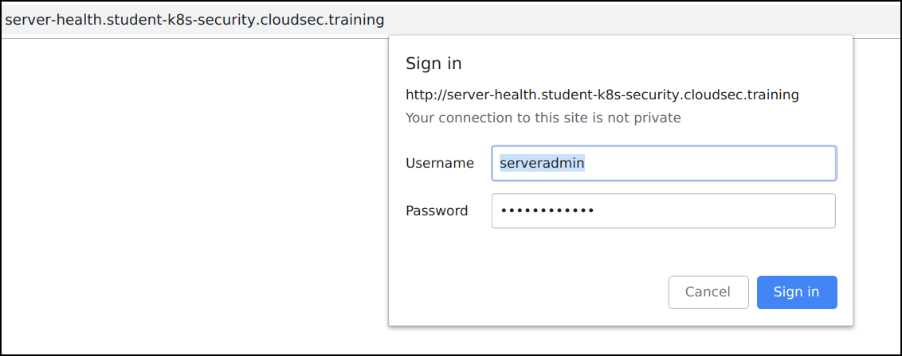
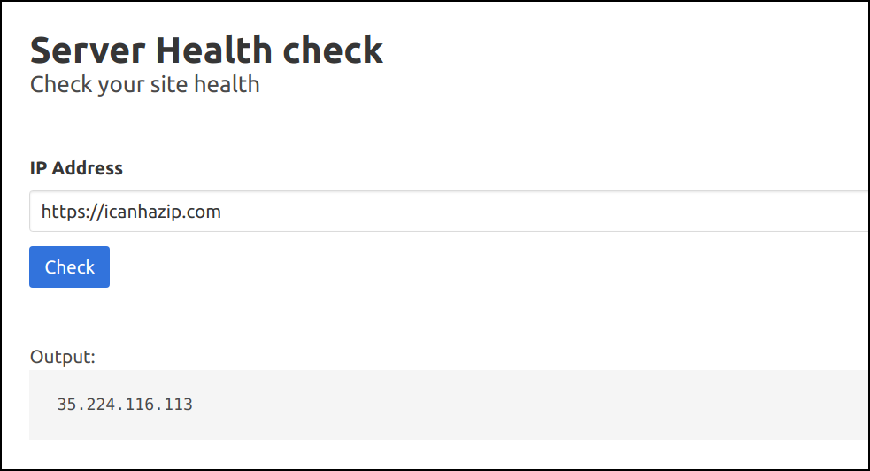
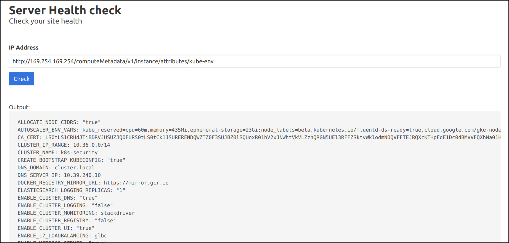
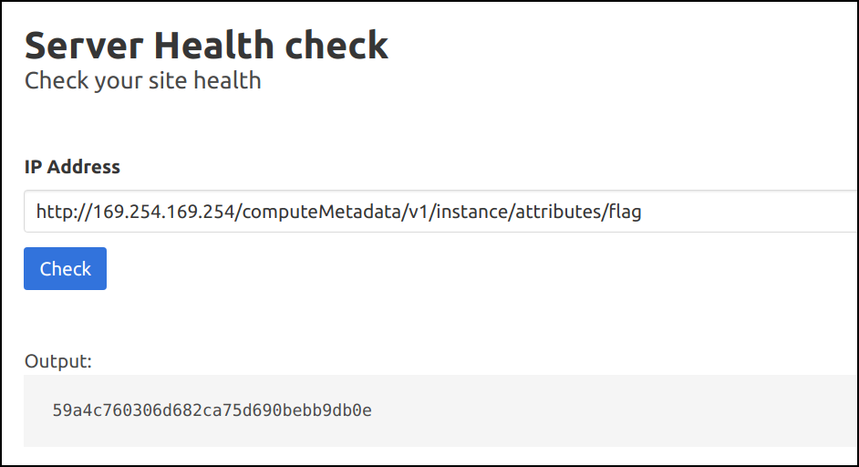

# Attacking Kubernetes cluster Metadata using application SSRF vulnerability - Solution

* Navigate to the application `http://server-health.student-uniquename.cloudsec.training`

* Login to the application using `username: serveradmin` and `password: monitorworld`



* The application supports functionality to check server health. Let's give `https://icanhazip.com` to check the public IP address



* As this setup is running on GCP, we can query the internal metadata using the standard endpoint `http://169.254.169.254/computeMetadata/v1/`


* Similarly we can query all the sensitive information, including the Kubernetes secrets and other information related to Cloud Platform `http://169.254.169.254/computeMetadata/v1/instance/attributes/kube-env`



* Also, we can find the flag by `http://169.254.169.254/computeMetadata/v1/instance/attributes/flag`

```bash
59a4c760306d682ca75d690bebb9db0e
```

