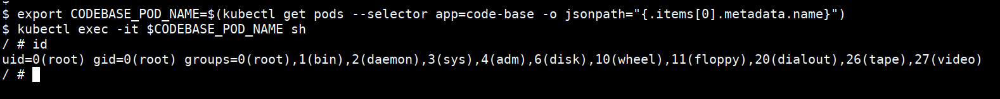
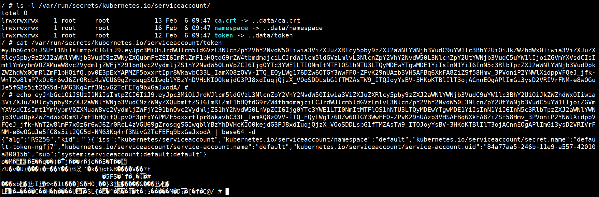
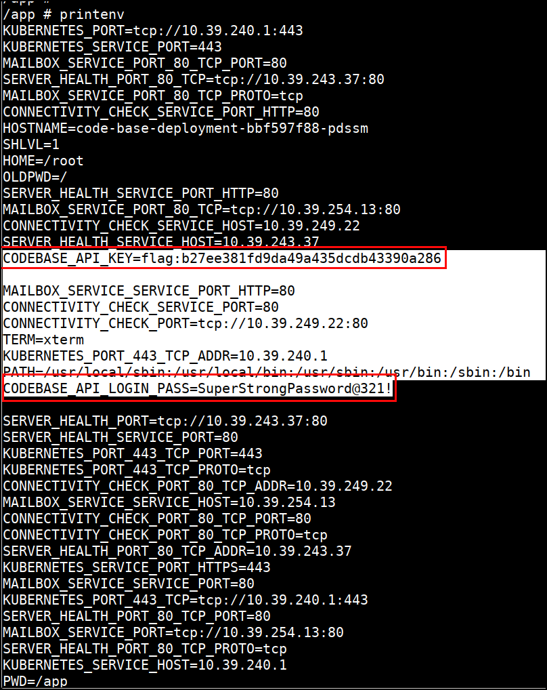
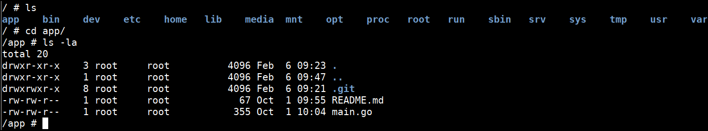
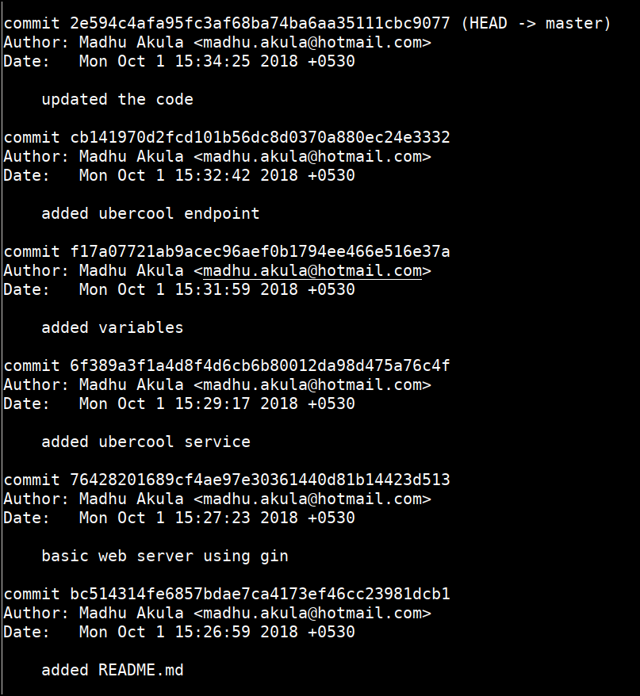
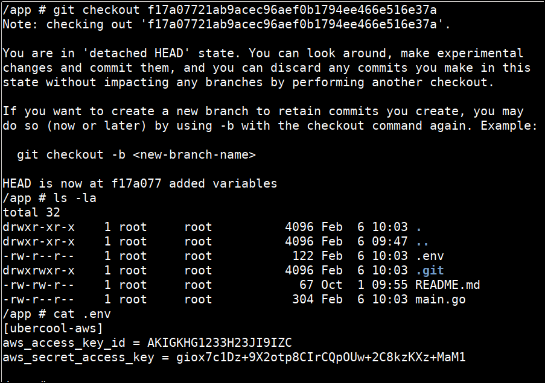

# Testing for the sensitive configurations and secrets in Kubernetes cluster - Solution

## Exec into Pod

* Get pod details and login to the `code-base` pod using below command

```bash
export CODEBASE_POD_NAME=$(kubectl get pods --selector app=code-base -o jsonpath="{.items[0].metadata.name}")
kubectl exec -it $CODEBASE_POD_NAME sh
```



## Kubernetes Service Account

* Now we can look for sensitive information by navigating the file system

* Look in the default kubernetes locations

```bash
ls -l /var/run/secrets/kubernetes.io/serviceaccount/
cat /var/run/secrets/kubernetes.io/serviceaccount/token
```



* Explore permissions available to service account using `kubectl auth can-i`

`kubectl` can be downloaded inside the Pod from [Install Kubectl](https://kubernetes.io/docs/tasks/tools/install-kubectl/#install-kubectl-on-linux)

## Check Environment

* Check for the environment variables



## App Secrets

* Find the app and the `.git` folder inside it which has old commits containing the sensitive information

```bash
cd /app
ls -la
git log
git checkout f17a07721ab9acec96aef0b1794ee466e516e37a
ls -la
cat .env
```




