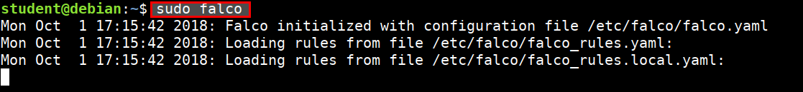
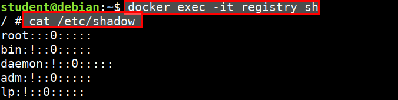
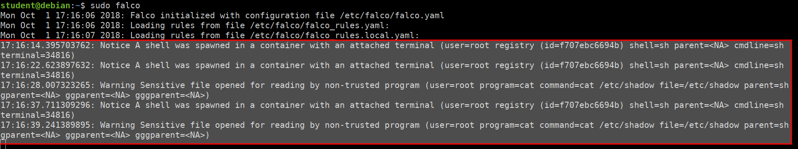
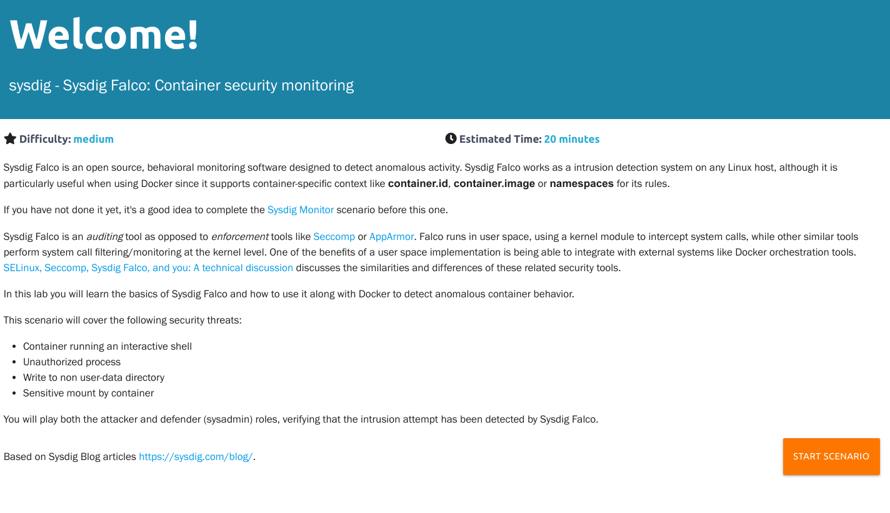

# Sysdig Falco

Sysdig Falco is an open source container runtime security. It is a behavioral monitoring software designed to detect anomalous activity. Sysdig Falco works as a intrusion detection system on any Linux host, although it is particularly useful when using Docker since it supports container-specific context like `container.id`, `container.image` or `namespaces` for its rules.

## Sysdig Falco Logging for Containers

* Run the following command in student VM

```bash
sudo falco
```


* Then start another container and perform operations like executing shell, reading shadow file, etc.

```bash
docker exec -it registry sh
cat /etc/passwd
cat /etc/shadow
```


## Falco attack detection based on ruleset



## Play with Sysdig Falco Scenario



[Sysdig Falco: Container security monitoring](https://www.katacoda.com/mateobur/scenarios/falco)